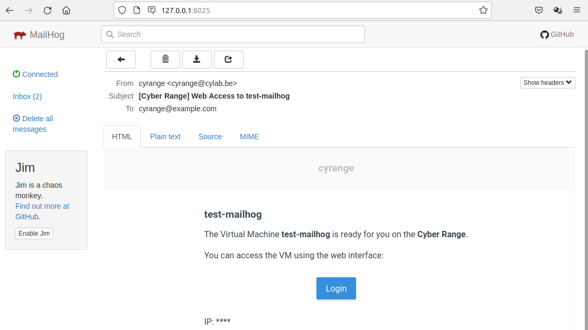

# Cyrange

[](https://gitlab.cylab.be/cylab/cyber-range-manager/-/commits/master)
[](https://gitlab.cylab.be/cylab/cyber-range-manager/-/commits/master)

Automatically deploy and provision virtual machines to run scenarios involving hundreds of machines and users. All machines are then accessible through a web interface...


Features:

- possibility to configure the guest system during deployment;
- possibility to perform bulk deployments, for all trainees of a class for example;
- built-in integration with Apache Guacamole web interface, which allows users to easily acces the screen and keyboard (mouse) of the virtual machines using a web browser.

## Documentation

* Installation with docker-compose: https://cylab.be/blog/132/installing-the-cyrange-cyber-range-platform
* Create your own images: https://cylab.be/blog/141/create-your-own-vm-image-for-the-cyber-range


## Contributing

Cyrange relies on multiple servers. Hence the easiest way to run a development environment is using docker-compose.

### Prerequisites

1. Install VirtualBox and start the virtualbox-webservice: https://cylab.be/blog/132/installing-the-cyrange-cyber-range-platform#virtualbox
2. Install Docker and docker-compose: https://cylab.be/blog/132/installing-the-cyrange-cyber-range-platform#docker

### Installation

```bash
git clone git@gitlab.cylab.be:cylab/cyrange.git
cd cyrange
cp .env.example .env
```

Modify ```.env```. You should at least modify ```VBOX_PASSWORD``` (and maybe ```VBOX_IMAGES```).

```bash
nano .env
```

Start the containers:

```bash
docker-compose up
```

After a few seconds cyrange will be available at http://127.0.0.1:8080

The default credentials are:

* E-mail: ```cyrange@example.com```
* Password: ```admin```

In the development environment, emails are sent to a ```MailHog```container. The web interface of MailHog will be available at ```http://127.0.0.1:8025```



### Working...

https://cylab.be/blog/190/run-a-development-environment-for-laravel-with-docker-compose#working-on-php-code
